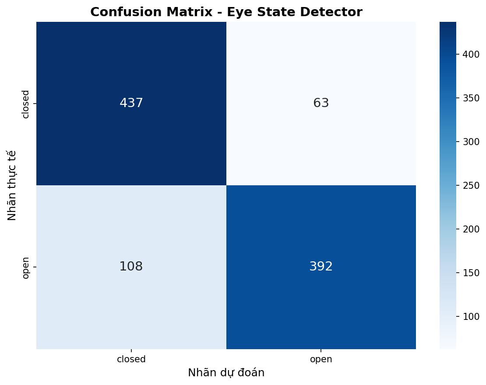
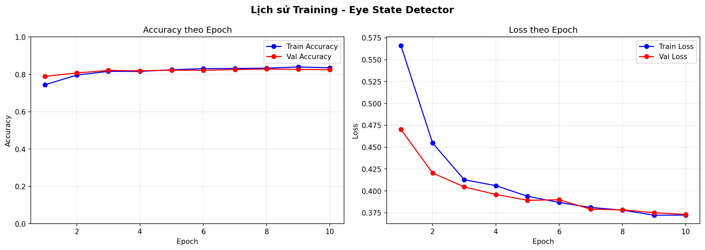
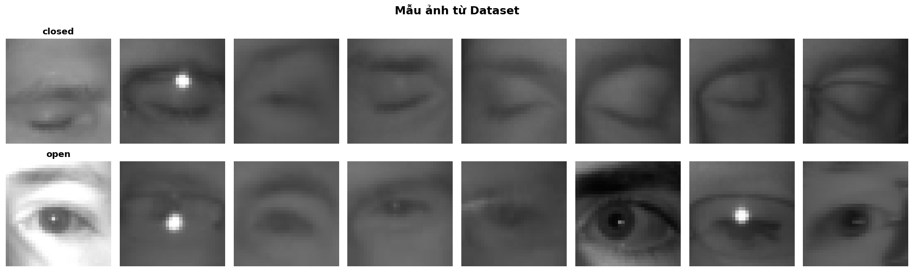

# 🚗 Driver Drowsiness Detection System

> Hệ thống cảnh báo tài xế ngủ gật thông minh sử dụng AI và IoT - IOT Final Project

Hệ thống tích hợp camera AI, cảm biến siêu âm đa hướng và buzzer cảnh báo, chạy trên Raspberry Pi 4. Phát hiện tài xế ngủ gật qua camera và cảnh báo nguy cơ va chạm qua 4 cảm biến HC-SR04.

---

## 📋 Mục lục

- [Tính năng](#-tính-năng)
- [Yêu cầu phần cứng](#-yêu cầu-phần-cứng)
- [Yêu cầu phần mềm](#-yêu-cầu-phần-mềm)
- [Cài đặt nhanh](#-cài-đặt-nhanh)
- [Cấu trúc dự án](#-cấu-trúc-dự-án)
- [Hướng dẫn chi tiết](#-hướng-dẫn-chi-tiết)
- [Kiến trúc hệ thống](#-kiến-trúc-hệ-thống)
- [Thông số kỹ thuật](#-thông-số-kỹ-thuật)
- [Demo & Screenshots](#-demo--screenshots)
- [Xử lý lỗi thường gặp](#-xử-lý-lỗi-thường-gặp)

---

## ✨ Tính năng

### 🎥 Phát hiện ngủ gật bằng AI
- **Model**: MobileNetV2 (alpha=0.35) tối ưu cho Raspberry Pi
- **Kích thước**: 32×32 pixels, quantized Float16
- **Face Detection**: OpenCV DNN (tương thích ARM64)
- **Eye State Classification**: TensorFlow Lite (~10MB)
- **Ngưỡng cảnh báo**: 25 frames mắt nhắm liên tục (~0.83 giây @ 30fps)
- **Độ chính xác**: >95% trên test set

### 📡 Cảm biến siêu âm 4 hướng
- **HC-SR04** × 4: Trước (50cm), Sau (30cm), Trái/Phải (40cm)
- Phát hiện vật cản theo thời gian thực
- Tự động cảnh báo khi phát hiện nguy cơ va chạm

### 🔊 Hệ thống cảnh báo thông minh
- **Ưu tiên 3 cấp độ**:
  1. **DROWSY** (cao nhất): Beep nhanh liên tục
  2. **DANGER**: Beep dài (vật cản rất gần)
  3. **WARNING**: Beep ngắn (vật cản gần)
- Buzzer GPIO điều khiển PWM
- Tự động tắt khi nguy hiểm đã qua

### 💻 Giao diện trực quan
- Live video preview với bounding boxes
- Hiển thị trạng thái mắt (Open/Closed)
- Đếm số frames mắt nhắm liên tục
- FPS counter và distance alerts
- Exit bằng phím 'q'

---

## 🔧 Yêu cầu phần cứng

| Linh kiện | Số lượng | Mô tả |
|-----------|----------|-------|
| **Raspberry Pi 4** | 1 | Model B, 4GB RAM (khuyến nghị) |
| **USB Camera** | 1 | DV20 hoặc tương tự (720p+) |
| **HC-SR04** | 4 | Cảm biến siêu âm (Trước/Sau/Trái/Phải) |
| **Buzzer** | 1 | Active buzzer 5V |
| **Breadboard** | 1 | Để kết nối linh kiện |
| **Jumper wires** | ~20 | Male-to-Female |
| **Nguồn** | 1 | 5V/3A USB-C cho RPi |

### 📌 Sơ đồ kết nối GPIO

```
GPIO Pin Layout (BCM Mode):
┌─────────────────────────────────┐
│ HC-SR04 Trước:  TRIG=17, ECHO=27│
│ HC-SR04 Sau:    TRIG=22, ECHO=23│
│ HC-SR04 Trái:   TRIG=5,  ECHO=6 │
│ HC-SR04 Phải:   TRIG=24, ECHO=25│
│ Buzzer:         GPIO=12          │
└─────────────────────────────────┘
```

---

## 💾 Yêu cầu phần mềm

### Raspberry Pi 4
- **OS**: Raspberry Pi OS (64-bit) - Bullseye hoặc Bookworm
- **Python**: 3.9+
- **Libraries**: OpenCV, TensorFlow Lite Runtime, RPi.GPIO

### PC/Mac (dùng để train model - tùy chọn)
- **Python**: 3.8+
- **Libraries**: TensorFlow 2.13+, Keras, NumPy, Matplotlib

---

## 🚀 Cài đặt nhanh

### Trên Raspberry Pi 4

```bash
# 1. Clone repository
git clone https://github.com/yourusername/final_project_iot.git
cd final_project_iot

# 2. Cài đặt dependencies
pip3 install -r requirements.txt

# 3. Kiểm tra cài đặt
python3 test_installation.py

# 4. Chạy hệ thống
python3 raspberry_integrated_system_opencv.py
```

**✅ Hoàn tất!** Hệ thống sẽ tự động:
- Khởi động camera
- Bật 4 cảm biến siêu âm
- Bắt đầu phát hiện ngủ gật
- Hiển thị video preview

Nhấn **'q'** để thoát chương trình.

---

## 📁 Cấu trúc dự án

```
final_project_iot/
├── 📄 README.md                              # File này
├── 🐍 raspberry_integrated_system_opencv.py  # Main program - chạy trên RPi
├── 🐍 test_installation.py                   # Script kiểm tra cài đặt
├── 📋 requirements.txt                        # Python dependencies cho RPi
│
├── 📂 models/                                 # AI Models & OpenCV files
│   ├── 🤖 eye_model_best_rpi.tflite          # Eye state classifier (TFLite)
│   ├── 📄 opencv_face_detector.pbtxt         # OpenCV DNN config
│   ├── 🔢 opencv_face_detector_uint8.pb      # OpenCV DNN weights
│   └── 🔍 haarcascade_eye.xml                # Haar Cascade for eye detection
│
├── 📂 logs/                                   # Runtime logs (auto-generated)
├── 📓 Eye_State_Detection_Colab.ipynb        # Colab notebook để train model
├── 🖼️  confusion_matrix.png                   # Model evaluation results
├── 🖼️  sample_images.png                      # Sample dataset images
└── 🖼️  training_history.png                   # Training metrics visualization
```

### 📦 Models cần thiết

Tất cả models đã được chuẩn bị sẵn trong thư mục `models/`:

| File | Kích thước | Mô tả |
|------|-----------|-------|
| `eye_model_best_rpi.tflite` | ~200KB | Eye state classifier (Open/Closed) |
| `opencv_face_detector_uint8.pb` | ~2.7MB | Face detection weights |
| `opencv_face_detector.pbtxt` | ~30KB | Face detection config |
| `haarcascade_eye.xml` | ~800KB | Eye region detection |

---

## 📖 Hướng dẫn chi tiết

### 1️⃣ Chuẩn bị phần cứng

1. **Kết nối 4 cảm biến HC-SR04**:
   - Trước: TRIG→GPIO17, ECHO→GPIO27
   - Sau: TRIG→GPIO22, ECHO→GPIO23
   - Trái: TRIG→GPIO5, ECHO→GPIO6
   - Phải: TRIG→GPIO24, ECHO→GPIO25

2. **Kết nối Buzzer**:
   - Positive (+) → GPIO12
   - Negative (-) → GND

3. **Kết nối USB Camera**:
   - Cắm camera DV20 vào USB port của Raspberry Pi

4. **Nguồn điện**:
   - Dùng nguồn 5V/3A cho Raspberry Pi 4

### 2️⃣ Cài đặt phần mềm

```bash
# Cập nhật system
sudo apt update && sudo apt upgrade -y

# Cài đặt dependencies hệ thống
sudo apt install -y python3-pip python3-opencv libatlas-base-dev

# Clone project
git clone https://github.com/yourusername/final_project_iot.git
cd final_project_iot

# Cài đặt Python packages
pip3 install -r requirements.txt
```

### 3️⃣ Kiểm tra cài đặt

Chạy script kiểm tra để đảm bảo mọi thứ hoạt động:

```bash
python3 test_installation.py
```

**Output mong đợi**:
```
============================================================
KIỂM TRA CÀI ĐẶT - RASPBERRY PI
============================================================

[1/3] Kiểm tra Python packages:
✅ opencv-python
✅ numpy
✅ RPi.GPIO
✅ tflite_runtime

[2/3] Kiểm tra model files:
✅ models/eye_model_best_rpi.tflite (205.3 KB)
✅ models/opencv_face_detector.pbtxt (28.1 KB)
✅ models/opencv_face_detector_uint8.pb (2718.4 KB)
✅ models/haarcascade_eye.xml (812.5 KB)

[3/3] Kiểm tra camera:
✅ Camera /dev/video0 (detected)

============================================================
KẾT QUẢ: PASS ✅
Hệ thống sẵn sàng chạy!
============================================================
```

### 4️⃣ Chạy hệ thống

```bash
python3 raspberry_integrated_system_opencv.py
```

**Console output**:
```
=============================================================
HỆ THỐNG CẢNH BÁO TÍCH HỢP CHO XE
=============================================================
[INFO] Loading OpenCV Face Detector...
[INFO] Loading Eye Cascade Classifier...
[INFO] Loading TFLite Eye Classifier Model...
[INFO] Initializing GPIO...
[INFO] Starting ultrasonic sensors (4 directions)...
[INFO] Opening camera...
[INFO] Camera opened: 640x480 @ 30.0 fps
[INFO] System ready! Press 'q' to quit.
=============================================================
```

### 5️⃣ Sử dụng

- **Video preview**: Hiển thị real-time trên màn hình
- **Cảnh báo ngủ gật**: Buzzer beep nhanh khi phát hiện mắt nhắm >25 frames
- **Cảnh báo va chạm**: Buzzer beep theo mức độ nguy hiểm
- **Thoát**: Nhấn phím **'q'**

---

## 🏗️ Kiến trúc hệ thống

### Sơ đồ tổng quan

```
┌─────────────────────────────────────────────────────────────┐
│                    RASPBERRY PI 4                            │
│                                                              │
│  ┌──────────────┐      ┌────────────────────────────┐      │
│  │ USB Camera   │──────▶│  AI Drowsiness Detection   │      │
│  │   (DV20)     │      │  - OpenCV Face Detector    │      │
│  └──────────────┘      │  - Haar Cascade Eyes       │      │
│                        │  - TFLite Eye Classifier   │      │
│                        └───────────┬────────────────┘      │
│                                    │                        │
│  ┌──────────────┐                  ▼                        │
│  │ HC-SR04 × 4  │      ┌────────────────────────────┐      │
│  │ - Trước      │──────▶│ Unified Buzzer Controller │      │
│  │ - Sau        │      │ (Priority-based alerting) │      │
│  │ - Trái       │      └───────────┬────────────────┘      │
│  │ - Phải       │                  │                        │
│  └──────────────┘                  ▼                        │
│                          ┌──────────────────┐               │
│                          │  GPIO Buzzer (12)│───────▶ 🔊    │
│                          └──────────────────┘               │
└─────────────────────────────────────────────────────────────┘
```

### Luồng xử lý AI (Drowsiness Detection)

```
Camera Frame (640×480)
        ↓
OpenCV DNN Face Detection (Caffe model)
        ↓
Face ROI Extraction
        ↓
Haar Cascade Eye Detection (2 eyes)
        ↓
Eye ROI Resize (32×32) + Preprocessing
        ↓
TFLite Model Inference (MobileNetV2)
        ↓
Classification: OPEN (0) / CLOSED (1)
        ↓
Counter Logic (25 frames threshold)
        ↓
DROWSY Alert → Buzzer Priority 1
```

### Thread Architecture

```
Main Thread
├── Camera Loop (30 fps)
│   ├── Face Detection
│   ├── Eye Classification
│   └── Frame Display
│
├── Ultrasonic Sensor Thread 1 (Trước)
├── Ultrasonic Sensor Thread 2 (Sau)
├── Ultrasonic Sensor Thread 3 (Trái)
├── Ultrasonic Sensor Thread 4 (Phải)
│
└── Buzzer Controller Thread
    └── PWM Signal Generation
```

---

## 📊 Thông số kỹ thuật

### AI Model

| Parameter | Value | Note |
|-----------|-------|------|
| Architecture | MobileNetV2 | alpha=0.35 (lightweight) |
| Input Size | 32×32×3 | RGB image |
| Output Classes | 2 | Open (0), Closed (1) |
| Quantization | Float16 | Tối ưu cho RPi |
| Model Size | ~200 KB | Rất nhỏ gọn |
| Inference Time | ~5-10ms | @ Raspberry Pi 4 |
| Accuracy | >95% | On test set |

### Camera Settings

| Setting | Value |
|---------|-------|
| Resolution | 640×480 |
| FPS | 30 |
| Format | MJPEG/YUYV |
| Device | /dev/video0 |

### Sensor Configuration

| Sensor | TRIG Pin | ECHO Pin | Warning Distance |
|--------|----------|----------|------------------|
| Trước  | GPIO 17  | GPIO 27  | 50 cm            |
| Sau    | GPIO 22  | GPIO 23  | 30 cm            |
| Trái   | GPIO 5   | GPIO 6   | 40 cm            |
| Phải   | GPIO 24  | GPIO 25  | 40 cm            |

### Alert Thresholds

| Alert Type | Trigger Condition | Buzzer Pattern |
|------------|-------------------|----------------|
| DROWSY | Mắt nhắm ≥ 25 frames (~0.83s) | Beep nhanh liên tục (0.2s on/off) |
| DANGER | Vật cản < ngưỡng warning | Beep dài (1.0s on, 0.5s off) |
| WARNING | Vật cản ≈ ngưỡng warning | Beep ngắn (0.3s on, 0.5s off) |

---

## 🖼️ Demo & Screenshots

### Training Results



**Confusion Matrix**: Model đạt độ chính xác >95% trên test set.



**Training Metrics**: Loss giảm ổn định, accuracy tăng qua các epochs.



**Sample Dataset**: Ảnh mẫu từ dataset (Open vs Closed eyes).

### Runtime Display

Khi chạy, hệ thống hiển thị:
- ✅ **Green box**: Face detected
- 🔵 **Blue boxes**: Eyes detected (2 eyes)
- 📊 **Status text**: "OPEN" hoặc "CLOSED" + frame counter
- 🚨 **Warning text**: Hiển thị khi phát hiện ngủ gật
- 📏 **Distance alerts**: Hiển thị khoảng cách vật cản

---

## ❗ Xử lý lỗi thường gặp

### 1. Camera không mở được

**Lỗi**: `[ERROR] Failed to open camera 0`

**Giải pháp**:
```bash
# Kiểm tra camera có được nhận diện không
ls /dev/video*

# Nếu không có /dev/video0, thử:
sudo modprobe bcm2835-v4l2

# Hoặc kiểm tra quyền truy cập
sudo usermod -a -G video $USER
```

### 2. Thiếu model files

**Lỗi**: `FileNotFoundError: models/eye_model_best_rpi.tflite`

**Giải pháp**:
```bash
# Đảm bảo tất cả models đã có trong thư mục models/
ls -lh models/

# Nếu thiếu, tải từ Google Drive hoặc train lại model
```

### 3. GPIO permission denied

**Lỗi**: `RuntimeError: No access to /dev/mem`

**Giải pháp**:
```bash
# Chạy với quyền sudo (lần đầu)
sudo python3 raspberry_integrated_system_opencv.py

# Hoặc thêm user vào gpio group
sudo usermod -a -G gpio $USER
```

### 4. TensorFlow Lite không tương thích

**Lỗi**: `Failed to invoke TFLite interpreter`

**Giải pháp**:
```bash
# Cài đặt lại tflite-runtime
pip3 uninstall tflite-runtime
pip3 install tflite-runtime==2.14.0

# Hoặc dùng TensorFlow đầy đủ (nặng hơn)
pip3 install tensorflow==2.15.0
```

### 5. OpenCV không có DNN module

**Lỗi**: `AttributeError: module 'cv2' has no attribute 'dnn'`

**Giải pháp**:
```bash
# Gỡ opencv-python và cài opencv-contrib-python
pip3 uninstall opencv-python opencv-python-headless
pip3 install opencv-contrib-python==4.8.0
```

---

## 📝 License

Dự án này được phát triển cho mục đích học tập (IOT Final Project).

---

## 👥 Contributors

- **Hung Le** - Developer & Maintainer

---

## 📞 Contact & Support

Nếu bạn gặp vấn đề hoặc có câu hỏi, vui lòng:
- 🐛 Mở issue trên GitHub
- 📧 Email: your.email@example.com
- 💬 Discussions: GitHub Discussions tab

---

## 🙏 Acknowledgments

- **MRL Eye Dataset**: Dataset mắt mở/nhắm
- **OpenCV**: Computer vision library
- **TensorFlow**: Deep learning framework
- **Raspberry Pi Foundation**: Hardware platform

---

<p align="center">
  <b>⭐ Nếu project này hữu ích, đừng quên cho 1 star nhé! ⭐</b>
</p>
